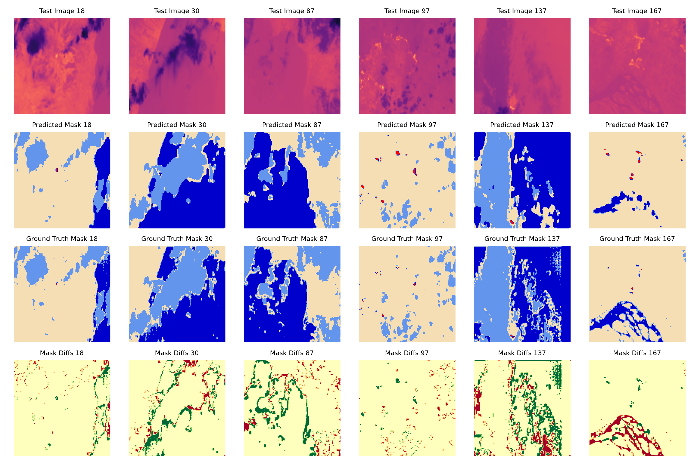
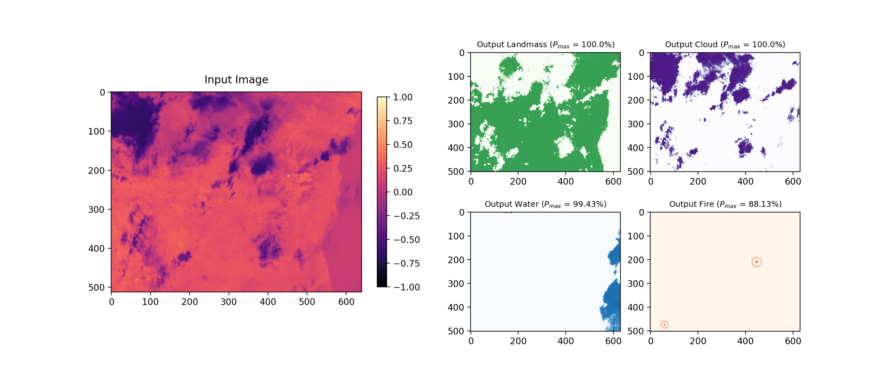

# Thermal Infrared Image Classifier

This repository contains the code and models for a machine learning project focused on classifying thermal infrared (IR) images. The models aim to identify and segment regions of interest within IR imagery.

## Overview
This repository contains the necessary files for training and evaluating an infrared cloud classification and mask prediction model. The model is designed to analyze infrared images and predict cloud masks, comparing them to ground truth data for evaluation.## Models

## Contents
The repository includes several trained models:

- `best_IR_clf_256x16_wc_2.keras` - best trained model for 256x256x1 TUBIN IR images
- `best_IR_clf_256x16_wc.keras` - base model file 256x256x1
- `best_IR_img2classmap_128x32_wc.keras` - trained to 128x128x1 images

## Code

- `TUBIN_IR_classifier_model.ipynb` - A Jupyter notebook containing the code for training the models, evaluating them, and possibly visualizing the results.
- `TUBIN_IR_cloudmask_generator.ipynb` - A Jupyter notebook containing the code for preprocessing TUBIN IR images and annotating class map including a threshold detection algorithm

## Results

The examples above show the evaluation results of the model. It includes test images, predicted masks, ground truth masks, and the differences between predictions and ground truth.

Output layers with different thresholds and fire pixel voting.

## Usage

To use these models for your own IR image classification and segmentation, you'll need to set up an environment with the necessary dependencies, load the models, and run the inference on your images.

### Prerequisites

- Python 3.x
- TensorFlow 2.x
- Keras
- NumPy
- Matplotlib (for visualization)
